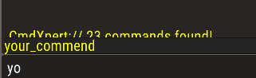
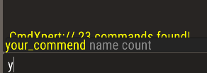
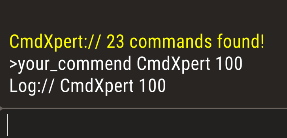
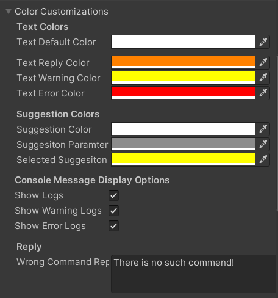
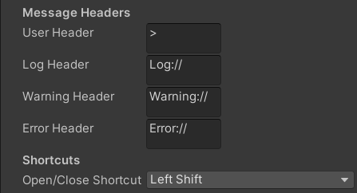

\--- ---

How to use
----------

Using this asset is very simple; you can call only a single function.

    CmdXpert.AddNewCommand("your_commend", x => YourFunction());
    

If your function takes parameters, you should provide them as shown below.

    private void Start()
    {
        CmdXpert.AddNewCommand("your_commend", x => YourFunction(x.String(), x.Integer()));
    }
    
    void YourFunction(string name, int count)
    {
        Debug.Log(name + " " + count);
    }
    

  

Additionally, you can also print the response to the console after executing the command.

    private void Start()
    {
        CmdXpert.AddNewCommand("your_commend", x => 
                YourFunction(x.String(), x.Integer()),"Command worked!");
    }
    
    void YourFunction(string name, int count)
    {
        Debug.Log(name + " " + count);
    }
    

Furthermore, you can customize the console as you like. You have control over changing all the variables you see in the image below.

  

What are the variables we can provide to the function?
------------------------------------------------------

The variables that can be assigned for now are as follows. Pay attention to the order and type requested by the function while entering your values.

*   **String** : To input a string value, simply write anything.
    
*   **Float** : To input a float value, type e.g.‘55’ ‘51,85’ or ‘95.0’.
    
*   **Integer** : To input a integer value do not use ‘,’ or ‘.’ e.g. ‘51’ or ‘95’.
    
*   **Boolean** : To input a boolean value, simply write ‘true’ or ‘false’.
    
*   **GameObject/Transform** : To input a GameObject or Transform type the name without space. If you leave a space while writing the name, only the first word of the name you wrote will be taken, so please write without leaving any space.
    
*   **Vector3/Vector3Int/Vector2/Vector2Int** : To input any Vector type values with spaces e.g. ‘4 6 8’ or ‘156.50 1 256.85’
    

If you have more questions, suggestions for additions, or if you notice anything missing, you can reach us through the following links:

[Discord](https://discord.gg/Em7WyPMf)  
[Twitter](https://twitter.com/SentinelGa54657)  
[Website](https://sentinelasset.store)
