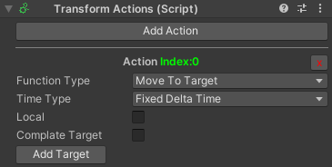

# Components

## Triggers
Different types of triggers are used to trigger the sensors.Below are descriptions of these triggers.Click this [`link`](#custom-trigger) to write your own trigger.

### Collider Trigger
Collider Trigger detects collisions and transmits them to the sensor. In order for it to work, it must have a collider component on it at the time of collision. For Is Trigger, the collider must be set to isTrigger=true. It must have a rigid body component for collision.


| Parameters | Description |
| - | - |
| Collider Trigger Type | "Is Trigger" only works when collider isTrigger=true."Collision" only works when it collides.|

### Key Trigger
Triggers the specified sensors when the key is pressed.


| Parameters | Description |
| - | - |
| Sensors | List of sensors to trigger. |
| Key Code | Selected key code. |

### Physic Trigger
Casts a ray, from position, in forward , of length maxDistance, against all colliders in the Scene.If ray touches the sensor it will trigger it.8 different types of ray can be sent.(Raycast,Box Cast,Capsule Cast,Sphere Cast,Line Cast,Overlap Box,Overlap Capsule,Overlap Sphere).See for more detailed [information](https://docs.unity3d.com/ScriptReference/Physics.html).


| Parameters | Description |
| - | - |
| Layer Mask | A Layer mask that is used to selectively ignore Colliders when casting a ray. |
| Physic Trigger Type | What kind of ray will be sent. |
| Max Distance | The max distance the ray should check for collisions. |

### Custom Trigger
Here are the steps to write your own trigger;

1- Create a script and name it like this to avoid confusion; Function definition + Trigger.


2- Copy and paste the code into your script and fill in the required fields.

```cs
using UnityEngine;
using Sentinel.Interaction;

public class CustomTrigger : Trigger
{
    void CustomVoid()
    {
        // When the desired condition is met, call SendTrigger and send data in, out or stay.
        SendTrigger(Sensor,TriggerType);
    }
}
```

:::tip
You can click on the script and select the icon from the inspector.
:::


## Sensor
When the sensor is triggered, it sends a list of functions that should take action.For each action, the trigger type to be sent must be selected.Let's explain this with an example for better understanding.

 

First, we add action data.

 

We choose which action or actions we want to influence.We enter the indexes to be sent.(In this example, DebugAction is triggered.)

 

And the result when triggered.

 

:::note
We can also apply a filter to the sensor. Currently, this feature is under development.
:::

## Actions
Actions become functional only when they are triggered. They are written for different components and functions. Since the asset has a flexible structure, you can add your own functions or change existing functions easily.Below you can see the existing actions and how you can add new actions.Click this [`link`](#custom-actions) to write your own action.

### Animator Actions
Used to control the animator easily.You can send int, bool, float and trigger data to the animator.Besides sending data, it also has different functions.

 

| Parameters | Description |
| - | - |
| Add SetValue | The type of data to send to the animator. |
| Function Type | Different types of functions. |
| Values | Different types of functions. |

### Debug Actions

It is used for debugging.

### Rigidbody Actions
Easily access the most used *Rigidbody* functions with its easy-to-use interface.


| Parameters | Description |
| - | - |
| Function Type | Different types of functions. |
| Force Mode | Please refer to this [document](https://docs.unity3d.com/ScriptReference/ForceMode.html) for more accurate information. |

### Transform Actions
Easily access the most used *Transfom* functions with its easy-to-use interface.



| Parameters | Description |
| - | - |
| Function Type | Different types of functions. |
| Time Type | Update time type. |
| Complate Target | Update until you reach the specified target. |

### Unity Event Actions
Invoke In,out and stay UnityEvent when triggered the sensor.


### Value Actions
Changes the values ​​of certain components in the object when triggered.Currently [`supported`](how-does-it-work#actions) components for this action.


Let's explain this with an example for better understanding.

 

If I want to sync my position with (0,2,0) I can first open the Converter and then select the value I want to sync.If you want to add your own component, all you have to do is write a line of code like below and add it to ValueActions.cs.

```cs
[System.Serializable]
public class CustomData : MainData
{
    [SerializeField] private int intValue;

    public void OnSet()
    {
        if (!avtive)
            return;
        CustomData comp = (CustomData)component;

        // The selection index required to select this object.
        if (selected[0])
            comp.intValue = intValue;
    }
}
```

### Custom Actions
Here are the steps to write your own actions;

1- Create a script and name it like this to avoid confusion; Function definition + Actions.


2- Copy and paste the code into your script and fill in the required fields.

```cs
using UnityEngine;
using Sentinel.Interaction;

public class CustomActions : Action
{
    [System.Serializable]
    public class Data
    {
        // It is only used to determine which index it is.
        [HideInInspector] public string className;
        public string newName;

        public void Set(GameObject go)
        {
            go.name = newName;
        }
    }

    [SerializeField] Data[] _datas;

    // When the trigger type from the sensor is "In", the sent indexes are processed.
    protected override void OnPlay_In(int index)
    {
        _datas[index].Set(gameObject);
    }
    // When the trigger type from the sensor is "Out", the sent indexes are processed.
    protected override void OnPlay_Out(int index)
    {
        _datas[index].Set(gameObject);
    }
    // When the trigger type from the sensor is "Stay", the sent indexes are processed.
    protected override void OnPlay_Stay(int index)
    {
        _datas[index].Set(gameObject);
    }

    private void OnValidate()
    {
        if (_datas == null)
            return;

        // It updates the data name every time there is a change.
        int index = 0;
        foreach (Data data in _datas)
        {
            data.className = "Index:" + index;
            index++;
        }
    }
}
```

:::tip
You can click on the script and select the icon from the inspector.
:::