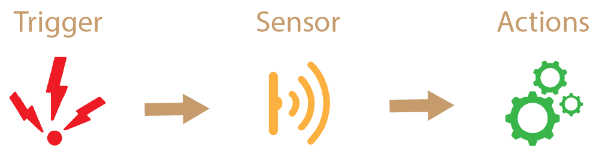

# How Does it Work

This asset will help you with the little things in your project. For example, you have a door in the game and you need to open and close it, you can use "Transform Actions" instead of opening a new script for this. Thanks to its completely flexible structure, you can easily add your own functions to the entity.This entity basically consists of 3 main classes. These main classes are trigger , sensor and action respectively.When the trigger is triggered, the sensor detects it and activates the action.The working scheme is as follows.

## Trigger

Triggers analyze data from external factors. According to the results, it sends in out and stay type data to the detected sensors. For example, Key Trigger sends data to certain sensors every time you press, release and hold a key. Below you can see when and under what conditions this data is transmitted to the sensors.

### Trigger Type In
This trigger type works once on first detection.
### Trigger Type Out
This trigger type works once when no sensors are detected.
### Trigger Type Stay
This trigger type works as long as it is detected.(FixedUpdate)

## Sensor

Sensors analyze the data from the triggers and report which functions are transmitted to the actions.The sensors also act as filters. It filters the data coming from triggers such as "In", "Out", "Stay" and ensures that only the desired data is transferred to the actions.Not only does it filter data from triggers, it also has its own filters. For example, the key filter does not transmit the incoming data directly to the sensor, instead it first checks whether the key has been pressed.

## Actions

Actions allow us to perform simple operations using functions within Unity. Unity has action systems for the most used components. Rotate, add force, move, etc. many operations can be done easily with a single component.
Below you can see the list of currently supported components.

import Tabs from '@theme/Tabs';
import TabItem from '@theme/TabItem';

<Tabs className="unique-tabs">
  <TabItem value="Supported Components"> 
    ➩ Animator  
    ➩ Camera  
    ➩ Debug    
    ➩ Rigidbody 3D   
    ➩ Transform   
    ➩ Unity Events   
    ➩ All 3D Collider  
    ➩ Component Value System
  </TabItem>
   <TabItem value="Components to be Supported"> 
    ➩ Rigidbody 2D   
    ➩ All 2D Collider
  </TabItem>
</Tabs>
