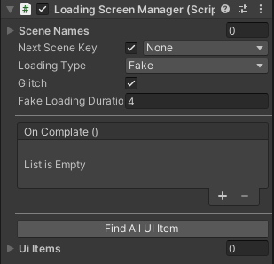
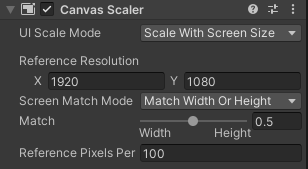
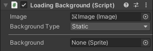
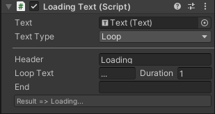
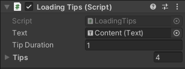
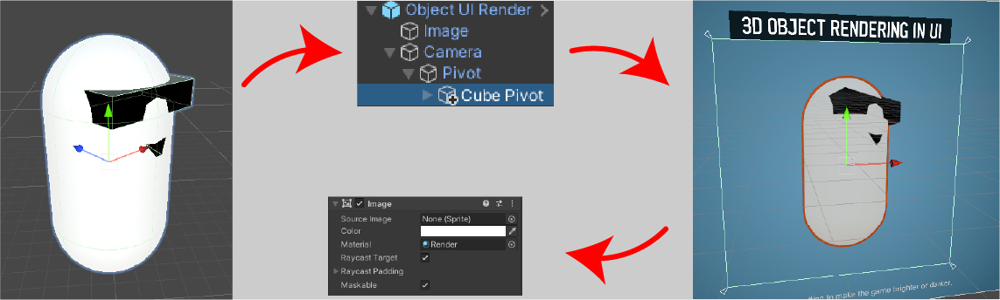

# Create Loading Screen

Learn how to create new custom loading screens.

## Loading Screen Manager

LoadingScreenManager is script that manages all operations.Simply drag the LoadingScreenManager.prefab object from the Assets>Sentinel>LoadingScreen>Prefabs file path onto the stage.

| Parameters | Description |
| - | - |
| Scene Names | All scene names that need to be loaded. |
| Next Scene Key | When the toggle is active, it waits for the button to be pressed when the loading screen is finished. | 
| Loading Type | Loading type. (Fake or Async) |
| Glitch | It adds realism by adding fake glitch. |
| Find All UI Item | Finds all UI elements in the scene and adds them to the list. When UI elements are added to the list, it works in harmony with the loading screen. |

## Canvas
Create your own game canvas.Adjust aspect ratio to be able to move UI objects easily.

## UI Items
All UI elements are derived from the LoadingScreenUI class.UI elements must be added to the LoadingScreenManager>UIItems list for correct use.
#### Header
Used to create headers easily.
#### Loading Background

| Parameters | Description |
| - | - |
| Background Type | Background type. (Dynamic or Static) |
#### Loading Bar Fill Amount
You can edit it as you wish by using the image settings in the Loading Bar Fill Amount>Bar section.To close the Handle object, it is sufficient to close the display object in it.
#### Loading Bar Slider
Slider object is same as unity slider object.
#### Loading Text
Shows loading information.You can see the result as an information message on the Inspector.

| Parameters | Description |
| - | - |
| Text Type | Text type. (Progress or Loop or Key)|
| Header | Writes a title before the captured information.|
| End | Writes a title after the captured information.|

#### Loading Tips
Shows tips during loading.

| Parameters | Description |
| - | - |
| Tips | List of tips. |
#### Object UI Render
Allows drawing 3D objects in the user interface. Displays game objects placed in camera>pivot in the UI.Throw the object to be processed to Camera>Pivot object.

