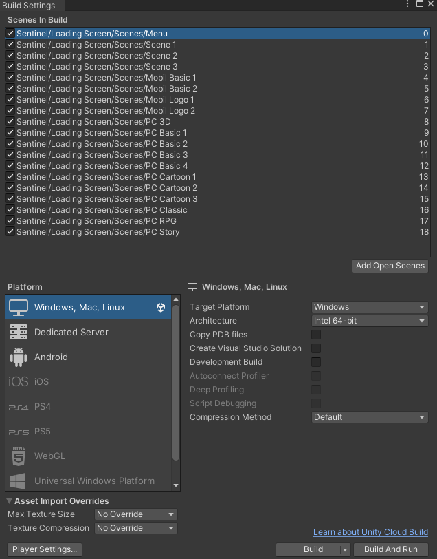

# How To Use

#### 1-Setup
Place all the scenes in the build.



#### 2-Integration.
You can load your scene using a single line of code.

>Sentinel.LoadingScreen.LoadScene(sceneName,loadingSceneName,additiveSceneNames);

| Parameters | Description |
| - | - |
| sceneName | Scene name to open. |
| loadingSceneName | Name of ready loading screens. | 
| additiveSceneNames | Additive scene name list. |


```cs
// Single scene
Sentinel.LoadingScreen.LoadScene("Scene Name","Loading Scene Name");
// Additive scene
Sentinel.LoadingScreen.LoadScene("Main Scene Name","Loading Scene Name",new string[2]{"Additive Scene 1","Additive Scene 2"});
```

:::tip Tip
Remove any loading screens you don't use from the build.Any unnecessary loading screens can increase the size of the build output.
:::