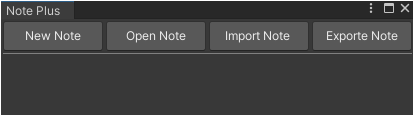
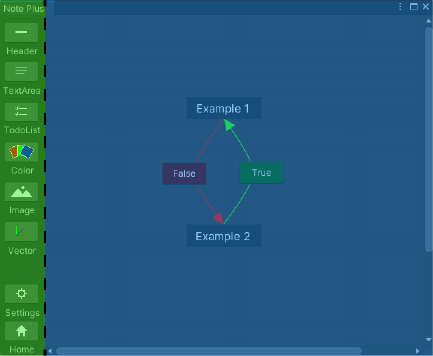

# How To Use

## 1- Open Editor (Shift + N)

It can be opened with the **Shift + N** hotkey or Sentinel/NotePlus window.

## 2- Editor Tabs

| Tab | Description |
| - | - |
| New Note | New note creation tab. The file path and name of the note to be created must be specified. |
| Open Note | Sorts existing notes. To open the note you want, simply click on it. | 
| Importe Note | Imports the note. Supports ".txt" or encrypted protective note file ".snpd" extensions. Note data to be imported and the file to be created with this data must be specified. |
| Export Note | Exports the note. Note data to be created can be exported as encrypted or txt. Note and file path to be created must be selected. |

## 3- Editor Interface

When we open the note, the screen that appears is divided into two parts.The blue area is the workspace. The green area is the area where the items that can be created and the settings of the items can be seen.The "Home" button under the green field leads to the home page. The "Settings" button contains the settings for the current workspace.All the properties of items that can be created are described in the items section of the document.