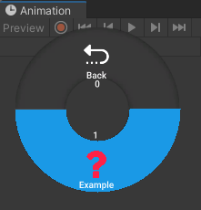

# Adding a function

All you need to do to add a function is to use the RadialMenu attribute.

```cs
[RadialMenu(UnityWindowType, "Path", "Icon")]
private static void ExampleFunctions()
{
    Debug.Log(_data.Example);
}
```

| Parameters | Description |
| - | - |
| UnityWindowType | Specifies to which Unity window the function will be added. |
| Path | Position in the menu. |
| Icon | Icons in the RadialMenu/Images folder are accessible. |

## Example

```cs
[RadialMenu(UnityWindowType.AnimationWindow, "Debug/Example", "")]
private static void ExampleFunctions()
{
    Debug.Log(_data.Example);
}
```

