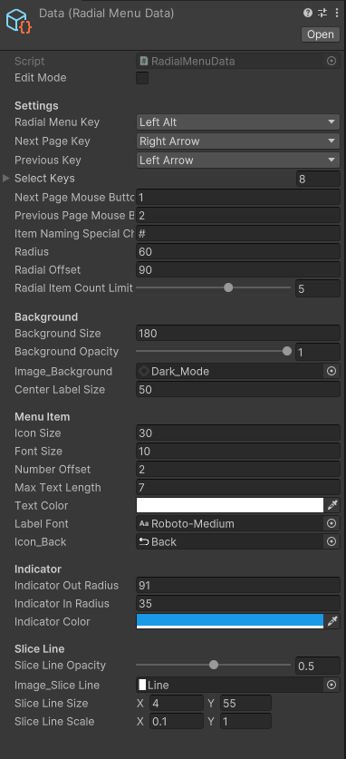

# How To Use

## Open Menu
After installing the plugin, you can access the menu by pressing the **ALT** key.
:::tip TIP
If there are any issues with the keys, you can adjust the settings in the Sentinel/RadialMenu/Data file.
::: 

## Menu Settings

You can customize radial menu settings as you like in the RadialMenu/Data file.

[Discord](https://discord.gg/Em7WyPMf)  
[Twitter](https://twitter.com/SentinelGa54657)  
[Website](https://sentinelasset.store)
