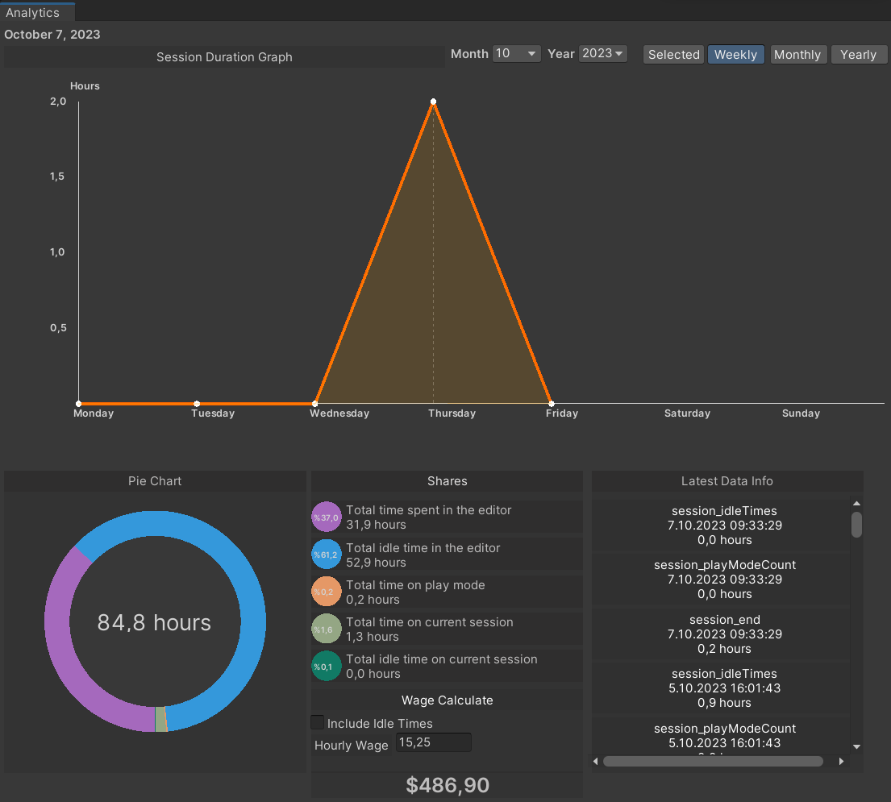

# How to use
After installing the asset into your project, two new buttons should be added to your screen as shown in the following picture.

# Project Details
When it comes to the functionality of these buttons, the **'Project Details'** button will display the information provided below.

We see the **'Show in hours'** option. This option determines whether the data will be displayed in **'hours**' or in **'days/hours/minutes/seconds'**.

The data displayed in this window includes the following:

-   Session opening date,
    
-   Total time spent on the project,
    
-   Total time spent in the last session,
    
-   Total time spent in Play Mode,
    
-   Total AFK time,
    
-   Total AFK time in the last session,
    
-   The total number of times the Play button was pressed.

# Analytics

The 'Analytics' button includes the following:

-   Monthly line chart by selecting a specific month and year,
    
-   Weekly line chart,
    
-   Monthly line chart,
    
-   Yearly line chart,
    
-   Pie chart depicting AFK and active time,
    
-   Information about the total time spent,
    
-   If you are a freelance worker, the ability to calculate your hourly rate based on the total time spent (including AFK time is up to you) is provided.

Line Graph
--

As you can see, a line graph is being plotted here. In this line graph, we have various options to introduce briefly. Firstly, to use the **'Selected'** button, on the left side, there are **'Month'** and **'Year'** options. By selecting the desired month and year from here, we obtain the graph for that specific month.

The next button we have is **'Weekly'** This button provides us with our weekly data. If it's Monday, this graph might not display data for you. Don't worry about it :)

Our other button is **'Monthly'** This button visualizes the data for the current month we are in. The initial data point on the graph starts from the day when data was first entered in that month.

The last button is **'Yearly'** As the name suggests, it displays your annual data. If you've been working on the project for more than a year, it will show the data for that duration.

Pie Chart
--

It displays a pie chart. The hour in the center represents the total time spent on the project.

Shares
--

You can see the percentage slices of the pie chart and what they represent in this section.

Wage Calculate
--
If you are a freelancer, this section is for you. We wanted to assist you in determining the compensation for the work you've done based on the data displayed in the left-side graph. There is a button here labeled **'Include idle times'** which includes AFK (Away From Keyboard) time in the payment calculation. We left the choice to include or exclude it up to you because if you spend extended periods coding in an application outside of Unity, the project might go idle, and the idle time gets added to the total time.

Latest Data Info
--
What you see here is a text list of the visualized data. It is listed from the most recent to the earliest.

If you have more questions, suggestions for additions, or if you notice anything missing, you can reach us through the following links:

[Discord](https://discord.gg/Em7WyPMf)  
[Twitter](https://twitter.com/SentinelGa54657)  
[Website](https://sentinelasset.store)
